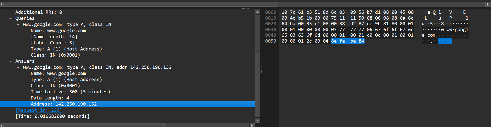
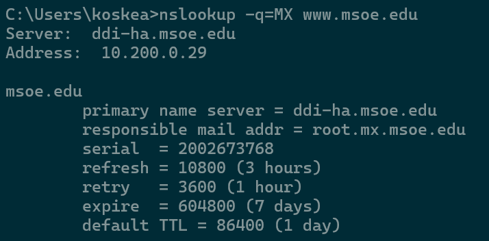
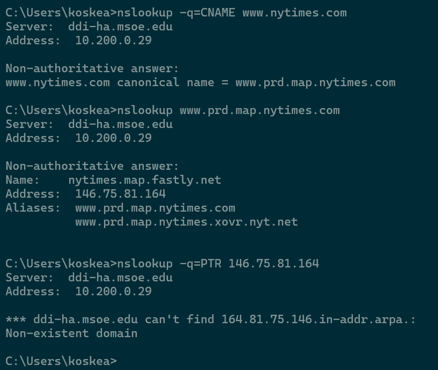

# CSC3511 Security and Network - Week 4 Homework

**Topic:** DNS\
*(You may find it helpful to consult the DNS specifications, RFC 1034
and RFC 1035)*

------------------------------------------------------------------------

## DNS Query Tools: nslookup vs dig

### nslookup

**Pros:** - Available on Windows, macOS, and Linux by default\
- Simple syntax; interactive mode available

**Cons:** - Limited output formatting\
- Some consider it deprecated (though still widely used)\
- Less flexible than dig

### dig (Domain Information Groper)

**Pros:** - More detailed output\
- Better for scripting\
- More flexible query options\
- Preferred by network professionals

**Cons:** - Not installed by default on Windows\
- Slightly more complex syntax

> For this homework, we'll use **nslookup**, but you are encouraged to
> explore **dig** as well.

------------------------------------------------------------------------

## Basic DNS Lookup

Open a command prompt and type:

``` bash
nslookup www.google.com
```

**Notes:**

1.  `nslookup` is used to query DNS servers for domain names and IP
    addresses.
2.  Running it without arguments enters *interactive mode*. Type `exit`
    to leave.

### Questions

1.  How many IP addresses do you see?
    - 3 IP addresses:
      - One DNS server `10.200.0.29`
      - One IPv4 `142.250.190.132`
      - One IPv6 \`2607:f8b0:4009:814::2004
2.  What similarities and differences do you notice between them?
    - The IPv4 and IPv6 addresses are for the same URI `www.google.com`.
    - The IP address `10.200.0.29` is for MSOE's local DNS server.
3.  What server services your reply (first line of the response)? Why
    might this be?
    - MSOE's DNS server services the reply, as it has a cache of
      Google's server address.
4.  Does your response say *"Non-authoritative answer"*? Why might this
    occur?
    - Yes, it does. It means that the response is not from an
      authoritative server, but rather the DNS server's cache.

------------------------------------------------------------------------

## Wireshark Network Analysis

Follow the steps below and answer Questions **5.1 -- 5.3.**

### Step-by-Step Instructions

1.  **Install and Launch Wireshark**

    - [Download Wireshark](https://www.wireshark.org/download.html)
    - Run as administrator (Windows)

2.  **Select Network Interface**

    - Choose your active network (usually WiFi) and start capture

3.  **Apply DNS Filter**

    - Enter `dns` in the filter bar and press Enter

4.  **Capture DNS Traffic**

    - With Wireshark running, run:

      ``` bash
      nslookup www.google.com
      ```

    - Stop capture after a few seconds

5.  **Analyze DNS Packets**

    - Expand **Domain Name System (query)** and **(response)** sections
      \### Questions

5.1. Can you find the IP addresses in the response packets? - Yes, there
are 2 response packets (one for IPv4 and one for IPv6). For each
response packet, the IP is located within the Answers section.


5.2. How are they encoded in the DNS packet structure? - IP addresses
are encoded in bytes (hexadecimal digits) in the response data


5.3. What other information do you see in the DNS packets? - We can also
see information like the DNS record type, class, tile to live, length of
data (in bytes) and additional flags.

> **Privacy Note:** Only capture traffic on networks you own or have
> permission to monitor.

------------------------------------------------------------------------

## Mail Query

### DNS Record Types

  ---------------------------------------------------------------------
  Record Type Description
  ----------- ---------------------------------------------------------
  **A**       Maps a domain name to an IPv4 address

  **MX**      Mail Exchange record; specifies mail servers + priority

  **CNAME**   Alias from one domain name to another

  **PTR**     Used for reverse DNS lookups (IP → domain name)
  ---------------------------------------------------------------------

------------------------------------------------------------------------

### MX Query Exercise

Run:

``` bash
nslookup -q=MX mit.edu
```

Example output:

    mit.edu mail exchanger = 10 mail.mit.edu
    mit.edu mail exchanger = 20 backup-mail.mit.edu

**Questions**

6.  What is the name of the mail server with the lowest priority number?

- `mail.mit.edu`

7.  What server services your reply?
    - The cache of MSOE'S DNS server `10.200.0.29`
8.  Does your response say *"Non-authoritative answer"*? Why might this
    occur?
    - Yes. This occurs as MSOE'S DNS server has a cache of the record.

------------------------------------------------------------------------

## Hierarchical Authoritative Lookup

Run:

``` bash
nslookup www.msoe.edu a.root-servers.net
```

You should see:

    Name: <domain>
    Served by:
    - d.gtld-servers.net
      192.31.80.30
      net

**Questions**

9.  What domain name do you get while looking up the mail server?

    - Primary Name Server: `ddi-ha.msoe.edu`
    - Responsible Mail Addr: `root.mx.msoe.edu`
      

10. Fill in the table as you move through the DNS hierarchy:

      Domain Name Server Doma   in Served IP     Address
      ------------------------- -------------- -----------
      a.root-servers.net (roo   t\) 19          8.41.0.4
      a.edu-servers.net edu     19              2.5.6.30
      1-05.azure-dns.com msoe   .edu 13.        107.236.5

11. Explain why the root server doesn't directly return the IP for
    [www.msoe.edu](http://www.msoe.edu).

    - The root server doesn't return the IP for www.msoe.edu because it
      doesn't store specific domain records.

- What does it return instead?
  - The root server instead returns a list of .edu TLD name servers that
    will have the records for .edu domains.
- Why is DNS designed this way?
  - To distribute load and allow scalability
- What are the advantages of this hierarchical approach?
  - ## Scalability, reduced load, and allow for faster query times

## Wireshark Sniffing

Run:

``` bash
nslookup www.nytimes.com
```

**Question:** Roughly how many query packets do you see (not counting
responses)? - There are 7 query packets

Then run:

``` bash
nslookup -nosearch -q=A www.nytimes.com
```

12. How many query packets do you see now?
    - There are 2 query packets

- The `-nosearch` and `-q=A` options should reduce the number of packets
  sent.

------------------------------------------------------------------------

## Time To Live (TTL)

Run:

``` bash
nslookup -d2 -nosearch -q=a www.msoe.edu
```

If that doesn't work, try:

``` bash
nslookup -debug www.msoe.edu
```

13. What is the TTL for the message?
    - 86400 (24 hours)

- How does it change between runs?
  - It decreases as time passes between runs until the record expires
    and must be refreshed from the authoritative server.
- What units are used?
  - Seconds

Now query the authoritative server:

``` bash
nslookup -d2 -nosearch -q=a www.msoe.edu <authoritative-name-server>
```

14. What is the TTL for this message?
    - 86400 seconds (24 hours)

    - How does it change between runs?

      - It does not decrease as it reports the original TTL value since
        it is the source of truth for the record.

    - Why does the authoritative server behave differently?

      - ## The authoritative server returns the full TTL because its the original source of the DNS record, not a cached copy on the MSOE DNS server.

## PTR Lookup

15. Use:

``` bash
nslookup -q=PTR 64.182.211.4
```

- What is the domain name for this IP?
  - `www.northpole.com`
- Where is the company located?
  - ## The website is hosted in a data center in Dallas, Texas (Gotten from [here](https://whatismyipaddress.com/ip/64.182.211.4). Not sure what else you were asking for.)

## CNAME Lookup

16. Use:

``` bash
nslookup -q=CNAME www.nytimes.com
```

17. Then, perform a PTR lookup on the resulting IP address.

    

- Why is the result not the same domain?
  - There is no resultant PTR record for the IP returned by the nslookup
    of nytimes's CNAME address.
