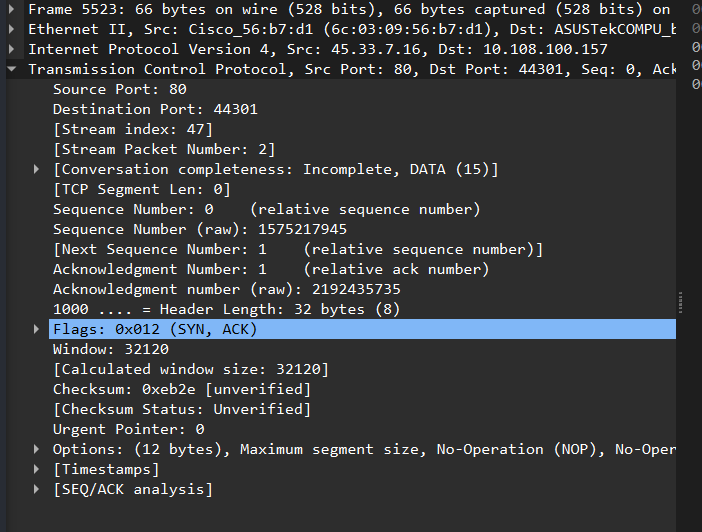
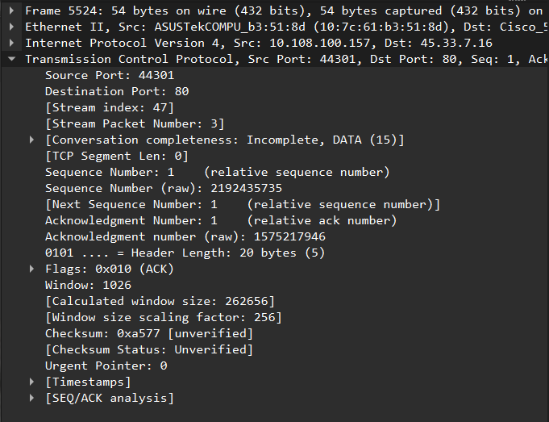
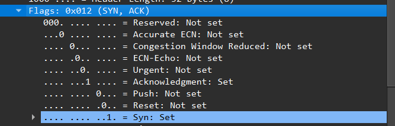
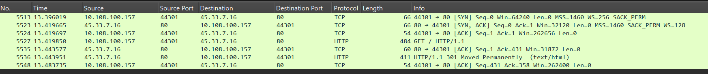
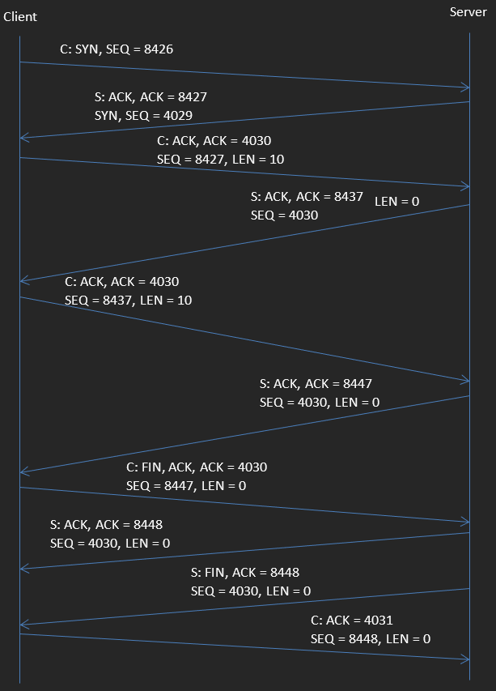
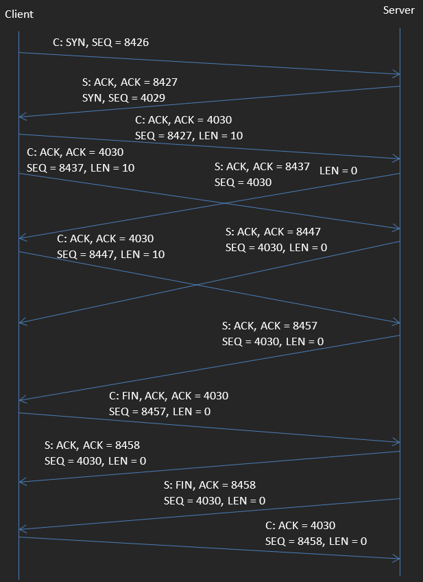

# CSC3511: TCP Wireshark

**Name:**  

---

## 1. HTTP Packet Analysis

1. Fire up Wireshark and start capturing. Browse to a webpage (e.g. `http://httpvshttps.com`).  
   Filter with the `http` filter and select the first packet in the request.  
   Turn off *auto-scroll*.  
   Now clear the `http` filter and press ENTER — the same packet should remain selected.  
   If helpful, right-click on the packet and select **Follow → TCP Stream** to isolate packets for that connection.  
   You may also use a filter like:  
   ```
   ip.addr == 45.33.7.16
   ```
   using your server’s IP address.

---

### a. TCP Ports
Identify where the TCP source and destination ports appear within the hexadecimal shorthand packet data.  
Look at a TCP connection to a web server.  

**Write the destination port (on the server) in:**
- Decimal: `80`
- Hexadecimal: `0x50`

---

### b. (If you have time) TCP Sequence and Acknowledgement Numbers
Identify the **TCP sequence number** and **acknowledgement number** in your packet.  

**Write these numbers (in hexadecimal only):**  
- Sequence number: `0`
- Acknowledgement number: `0` 

---

### c. (If you have time) Maximum TCP Source Port
Determine the **maximum value** of the TCP source port.  

**Answer:** `65535`

**[Source](https://www.pico.net/kb/what-is-the-highest-tcp-port-number-allowed/)**

---

### d. (If you have time) Maximum TCP Sequence Number
Determine, approximately, the **maximum value** of the TCP sequence number.  

**Answer:** `4,294,967,295` = $(2^{32} - 1)$

---

## 2. SYN and ACK Messages

### a.
Identify the **SYN packet** sent from the client to the server.  
**Sequence number:** `0`

---

### b. (If you have time)
Identify the **SYN packet** sent from the server to the client in response.  
Does the packet have the **SYN value** you expect?  
**Answer:** Yes. The server replied with **SYN + ACK** (`0x012`)



---

### c. (If you have time)

Identify the **second packet** from the client to the server.
Does it have the **SYN and ACK** values you expect?
**Answer:** Yes. The second packet from the **client** has only the **ACK** flag set (`0x010`), which is expected. This confirms the final step of the TCP three-way handshake — the client acknowledges the server’s **SYN + ACK**.



---

### d. (If you have time)
Identify the **SYN and ACK fields** within the TCP header.  
Repeat the above exercises considering the **actual values** rather than Wireshark’s interpreted ones.  
**Answer:**  



---

### e. (If you have time)
Can you see any other **TCP packets** to the same server?  
**Answer:** Yes, there is one HTTP GET request, an ACK to that request, one HTTP GET response, and one ACK to that response.



---

### f. (If you have time)
Explore the **other fields** in the packet.  
**Questions you have about them:**  
   - What are the other flags? (Reserved, Accurate, Urgent, etc)

---

## 3. TCP with Stop-and-Wait

Fill in the blanks in the following TCP stream.  
*(The numbers are above the arrows they describe.)*  



---

## 5. TCP with Pipelined Sliding Window

Fill in the blanks below.  
*(The numbers are above the arrows they describe.)*

